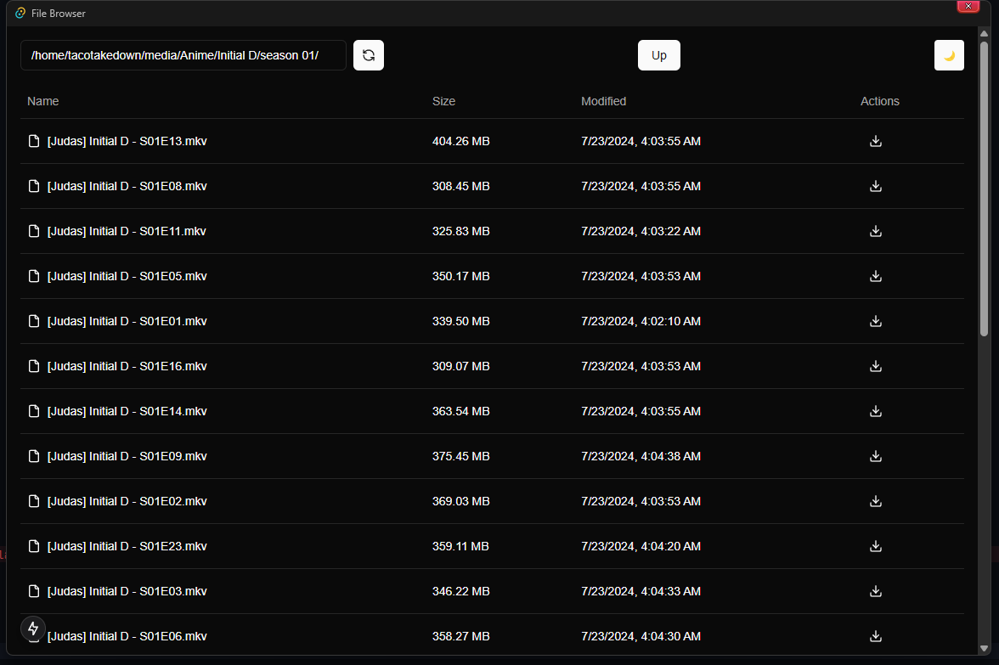
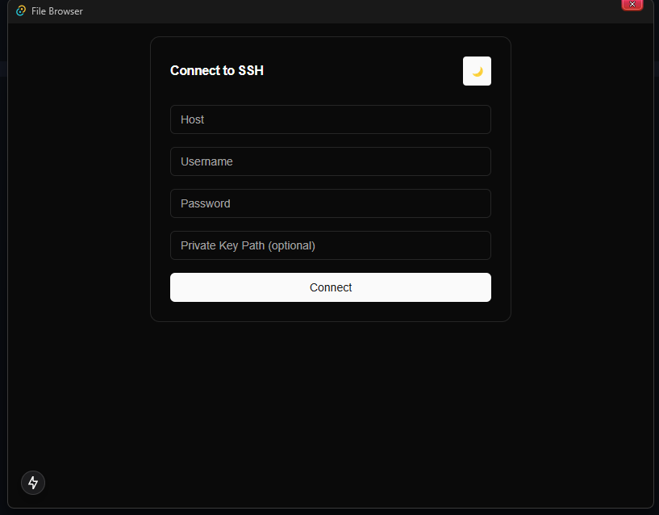

# Taco's File Browser

lightweight SSH file browser made with Tauri / NextJs

## Preview




## Building

```shell
git clone https://github.com/Tacotakedown/file-browser.git && cd file-browser

bun i

# Dev server
bun tauri dev

# Production Build
bun tauri build

```

## TODO

- Refactor UI (rn its just shadcn base components 😭)
- config files
- better SSH keys
- Download Progress
- Upload Progress && Upload UI
